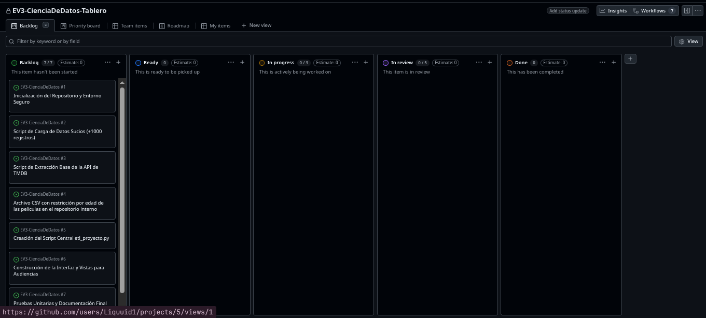
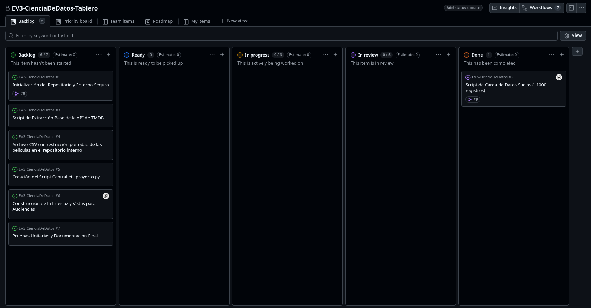
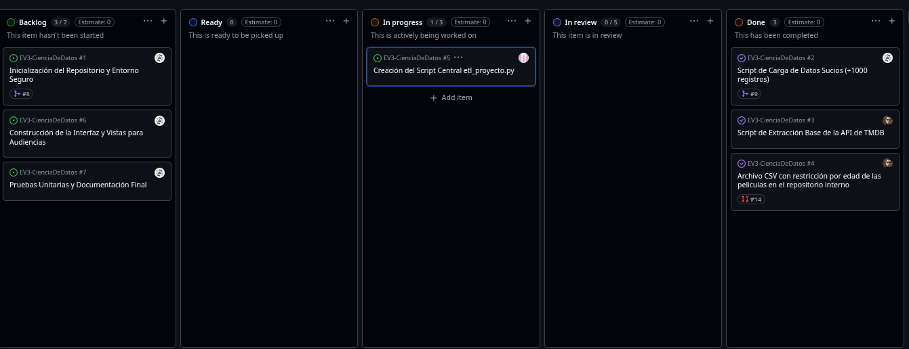

# Linea de tiempo y planificación del proyecto

Este documento funcionara como una bitacora oficial de cambios a lo largo del proyecto

## FASE 0 - PLANIFICACIÓN

Como equipo decidimos elegir como tema para este proyecto una plataforma de streaming nacional que se dedica a transmitir peliculas en internet. Consumiremos datos de la api publica **https://themoviedb.org** para tener mas información de las peliculas, simularemos un catalogo interno en una base de datos en la nube en **https://tidbcloud.com/** y tambien guardaremos restricciones legales regionales en un archivo csv local. Todo esto llevara a una tabla en la base de datos con los datos limpios y listos para hacer dashboards interactivos.

### Organización

Para organizar el proyecto generamos issues en Github y creamos un github proyects para mantener el trackeo de las tareas en las que esta trabajando cada uno. Cada issue tiene su propia rama definida y estas ramas deberan pasar por un pull request para pasar a main. Los issues creados son los siguientes:

1) Inicialización del Repositorio y Entorno Seguro
2) Script de Carga de Datos Sucios (+1000 registros)
3) Script de Extracción Base de la API de TMDB
4) Archivo CSV con restricción por edad de las peliculas en el repositorio interno
5) Creación del Script Central etl_proyecto.py
6) Construcción de la Interfaz y Vistas para Audiencias
7) Pruebas Unitarias y Documentación Final

En el estado actual el tablero del proyecto se ve así:

## FASE 1 - PRE DESARROLLO

En esta fase nos enfocaremos como equipo en crear las 3 fuentes de datos que utilizaremos para el proceso ETL. Estos archivos se componen de:

1) Una base de datos con una tabla con datos sucios, esta tabla tiene las siguientes columnas:

    a.- id_pelicula  
    b.- titulo_original  
    c.- reproducciones_mensuales  
    d.- fecha_estreno_plataforma  
    e.- servidor_origen  

2) Datos rescatados desde la API mencionada más arriba que nos sirvan para llenar la tabla objetivo en la base de datos

3) Un archivo CSV local con las restricciones de edades para las peliculas

Como todos los archivos tienen que compartir un ID para poder hacer los cruces, lo primero en levantarse tiene que ser los datos en la base de datos para que sirvan de guia los IDs de esa base de datos para la creación de los otros archivos.

### PRIMERA ACTUALIZACIÓN

Se logro llenar la base de datos con 407 registros de peliculas con ids que se pueden encontrar en la API, la vista del tablero en este momento es esta:

### SEGUNDA ACTUALIZACIÓN

En base a los IDs presentes en la base de datos con datos sucios, se logró automatizar la creación del archivo CSV con las restricciones de edad, y se creo un script que devuelve un Dataframe con la información faltante desde la API que estamos usuando, el tableto en este momento se ve así:

